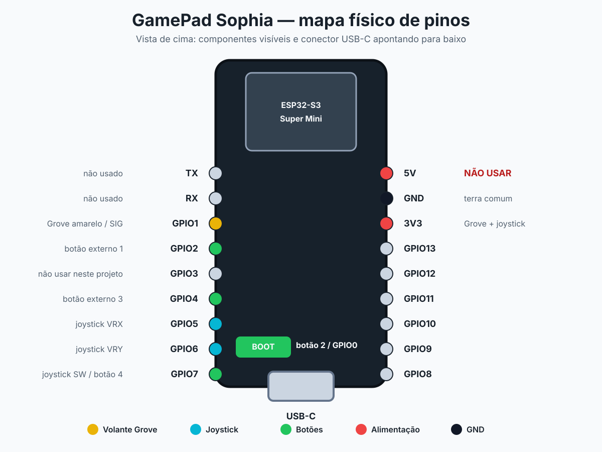

# GamePad Sophia — controle BLE com ESP32-S3

Firmware em ESP-IDF para transformar um **ESP32-S3 Super Mini** em um gamepad
Bluetooth Low Energy. O projeto possui:

- joystick analógico X/Y para navegar em menus;
- potenciômetro Grove no eixo Rx para usar como volante;
- três botões digitais, incluindo o BOOT da placa;
- botão do próprio joystick como quarto botão;
- página web local para testar todos os eixos e botões.

O projeto usa ESP-IDF puro, NimBLE e os arquivos auxiliares do exemplo oficial
da Espressif. Não é necessário Arduino nem copiar arquivos de outros projetos.

## Atenção antes de ligar ou soldar

> **Use 3,3 V no Grove e no joystick. Não use 5 V.**

O pino de alimentação do joystick pode estar marcado como `5V`, mas neste
projeto ele deve ser ligado ao pino **3V3** do ESP32-S3. As saídas VRX e VRY
acompanham a tensão de alimentação; alimentar o módulo com 5 V pode danificar as
entradas analógicas do ESP32-S3.

Antes de soldar:

1. Desconecte o cabo USB e qualquer bateria.
2. Confira a serigrafia impressa ao lado de cada pino da placa.
3. Faça as ligações de alimentação primeiro: GND e depois 3V3.
4. Faça as ligações de sinal.
5. Use um multímetro para verificar se não existe curto entre 3V3 e GND.
6. Só então conecte o USB.

Todos os módulos e botões precisam compartilhar o mesmo **GND**.

## Materiais

- 1 × ESP32-S3 Super Mini com Bluetooth;
- 1 × joystick analógico de cinco pinos (`GND`, `5V`/VCC, `VRX`, `VRY`, `SW`);
- 1 × Grove Rotary Angle Sensor;
- até 2 × botões momentâneos normalmente abertos para GPIO2 e GPIO4;
- fios, solda e cabo USB de dados.

Os botões externos são opcionais. O botão BOOT e o botão SW do joystick já
permitem testar dois botões sem componentes adicionais.

## Mapa físico do ESP32-S3 Super Mini



O desenho representa a versão comum do ESP32-S3 Super Mini, vista pelo lado dos
componentes e com o USB-C apontando para baixo. Alguns fabricantes mudam o
layout entre lotes: **a identificação impressa na sua placa é sempre a referência
final**.

Mapa em texto para consulta rápida:

```text
           ESP32-S3 SUPER MINI — VISTA DE CIMA
              componentes voltados para você

                ┌────────────────────┐
 não usado  TX  ○│                    │○ 5V    NÃO USAR
 não usado  RX  ○│                    │○ GND   terra comum
 Grove SIG   1  ○│                    │○ 3V3   Grove + joystick
 botão 1     2  ○│                    │○ 13    não usado
 evitar      3  ○│                    │○ 12    não usado
 botão 3     4  ○│                    │○ 11    não usado
 VRX         5  ○│                    │○ 10    não usado
 VRY         6  ○│  BOOT = botão 2   │○ 9     não usado
 SW          7  ○│                    │○ 8     não usado
                └─────── USB-C ──────┘
```

GPIO0 não aparece na fileira lateral porque já está ligado ao botão **BOOT** da
placa. GPIO3 é um pino de configuração de inicialização e foi deixado livre.

## Ligações completas

### Joystick analógico

| Pino escrito no joystick | Ligar no ESP32-S3 | Função no gamepad |
|---|---|---|
| `GND` | `GND` | Terra comum |
| `5V` ou `VCC` | **`3V3`** | Alimentação segura |
| `VRX` | `GPIO5` / ADC1_CH4 | Eixo X do joystick |
| `VRY` | `GPIO6` / ADC1_CH5 | Eixo Y do joystick |
| `SW` | `GPIO7` | Botão 4 |

O firmware aplica uma zona morta no centro do joystick para reduzir movimento
involuntário nos menus.

### Grove Rotary Angle Sensor

| Cor do fio Grove | Ligar no ESP32-S3 | Função |
|---|---|---|
| Amarelo | `GPIO1` / ADC1_CH0 | Sinal analógico do volante Rx |
| Branco | Não conectar | NC, sem uso |
| Vermelho | `3V3` | Alimentação |
| Preto | `GND` | Terra comum |

### Botões

| Botão no gamepad | Ligação | Observação |
|---|---|---|
| Botão 1 | botão externo entre `GPIO2` e `GND` | Opcional |
| Botão 2 | botão `BOOT` da placa / GPIO0 | Já existe na placa |
| Botão 3 | botão externo entre `GPIO4` e `GND` | Opcional |
| Botão 4 | `SW` do joystick em `GPIO7` | Pressionar o joystick |

Para os botões externos, use contatos momentâneos normalmente abertos:

```text
GPIO2 ───── botão 1 ───── GND
GPIO4 ───── botão 3 ───── GND
```

Não ligue 3V3 ou 5V aos botões. O firmware ativa os resistores pull-up internos:
o botão solto fica em nível alto e o botão pressionado fecha o GPIO com GND.

O BOOT funciona como botão 2 depois que o firmware inicia. Não mantenha BOOT
pressionado enquanto liga ou reinicia a placa, pois GPIO0 em nível baixo durante
a inicialização coloca o ESP32-S3 no modo de gravação.

## Mapeamento reconhecido pelo computador

| Controle físico | Entrada HID |
|---|---|
| Joystick esquerda/direita | Eixo X |
| Joystick cima/baixo | Eixo Y |
| Grove / volante | Eixo Rx |
| Botão externo GPIO2 | Botão 1 |
| BOOT | Botão 2 |
| Botão externo GPIO4 | Botão 3 |
| Pressionar o joystick | Botão 4 |

O relatório HID usa Report ID 1, três eixos assinados de 16 bits e quatro bits
de botão. Uma atualização é enviada a cada 20 ms.

## Instalação do ambiente

Use **ESP-IDF v5.5.x** com suporte ao ESP32-S3.

### Windows

1. Instale o Git.
2. Instale o ESP-IDF v5.5 pelo instalador oficial da Espressif.
3. No menu Iniciar, abra **ESP-IDF 5.5 PowerShell** ou **ESP-IDF 5.5 Command Prompt**.
4. Confirme a versão:

```powershell
idf.py --version
```

O resultado deve mostrar `ESP-IDF v5.5` ou outra versão `v5.5.x`.

### Linux ou macOS

Depois de instalar o ESP-IDF v5.5, ative o ambiente. Exemplo:

```bash
. "$HOME/esp/esp-idf/export.sh"
idf.py --version
```

Consulte o guia oficial caso o ESP-IDF ainda não esteja instalado:
[Get Started — ESP-IDF](https://docs.espressif.com/projects/esp-idf/en/v5.5/esp32s3/get-started/index.html).

## Baixar e compilar

Execute no terminal com o ambiente ESP-IDF ativo:

```bash
git clone https://github.com/engperini/GamePad-Esp32s3-DIY.git
cd GamePad-Esp32s3-DIY
idf.py set-target esp32s3
idf.py build
```

Ao final, deve aparecer `Project build complete`. O arquivo
`sdkconfig.defaults` já ativa Bluetooth, NimBLE e o serviço HID.

## Identificar a porta correta

Nunca copie uma porta COM de outro computador sem conferir.

No Windows:

1. Abra o **Gerenciador de Dispositivos**.
2. Expanda **Portas (COM e LPT)**.
3. Desconecte e reconecte somente o ESP32-S3.
4. Anote a porta que desaparece e reaparece, por exemplo `COM7`.

No Linux, normalmente será `/dev/ttyACM0` ou `/dev/ttyUSB0`. No macOS,
normalmente será `/dev/cu.usbmodem...` ou `/dev/cu.usbserial...`.

## Gravar o firmware

Substitua `COM7` pela porta identificada no seu computador:

```powershell
idf.py -p COM7 flash monitor
```

No Linux ou macOS, exemplo:

```bash
idf.py -p /dev/ttyACM0 flash monitor
```

O monitor deve mostrar mensagens semelhantes a:

```text
HID iniciado
GamePad Sophia pronto; aguardando pareamento BLE
```

Use `Ctrl+]` para sair do monitor serial. Se a gravação não iniciar
automaticamente, segure BOOT, pressione e solte RESET, solte BOOT e tente o
comando novamente.

## Parear por Bluetooth

1. Abra as configurações Bluetooth do computador, celular ou TV.
2. Adicione um novo dispositivo Bluetooth.
3. Selecione **GamePad Sophia**.
4. Quando solicitado, informe o PIN **123456**.
5. Aguarde o sistema indicar que o controle está conectado.

Se uma versão anterior do firmware já foi pareada, remova o dispositivo antigo
do Bluetooth e faça o pareamento novamente. O Windows pode manter em cache o
nome e o descritor HID antigos.

## Testar no Windows

### Teste nativo

1. Pressione `Win + R`.
2. Digite `joy.cpl` e pressione Enter.
3. Selecione **GamePad Sophia**.
4. Clique em **Propriedades** e abra a aba **Testar**.
5. Mova o joystick, gire o volante e pressione os botões.

### Página web incluída

Com o gamepad pareado, execute na pasta do repositório:

```powershell
python -m http.server 8000 --directory server_teste
```

Abra [http://localhost:8000](http://localhost:8000) no Chrome ou Edge e pressione
um botão do gamepad. A página mostra joystick X/Y, volante Rx e os quatro botões.

Se houver outro joystick conectado, use o campo **Controle testado** para
selecionar o GamePad Sophia. Dependendo do Windows e do navegador, ele pode
aparecer como `Unknown Gamepad`; nesse caso, escolha o controle que possui três
eixos e quatro botões.

## Calibração

Os valores abaixo ficam no início de `main/esp_hid_device_main.c`:

- `ADC_MIN` e `ADC_MAX`: limites do Grove/volante;
- `JOYSTICK_CENTRO`: centro nominal do joystick;
- `JOYSTICK_ZONA_MORTA`: região central ignorada para evitar movimento sozinho.

O Grove possui curso mecânico aproximado de 300°, mas o curso usado na montagem
pode ser menor. Depois da montagem definitiva, meça as leituras nos dois
extremos, ajuste os valores e compile novamente.

## Solução de problemas

### O controle não aparece no Bluetooth

- confirme que o log mostrou `GamePad Sophia pronto`;
- desligue e ligue o Bluetooth do computador;
- remova pareamentos antigos chamados `Volante DIY`, `NimBLE` ou
  `GamePad Sophia` e pareie novamente.

### A placa mostra “waiting for download”

GPIO0 ficou baixo durante a inicialização. Solte o botão BOOT e pressione RESET.

### Joystick parado, mas o menu se move sozinho

- confira se o joystick está alimentado por 3V3 e compartilha o mesmo GND;
- confira VRX no GPIO5 e VRY no GPIO6;
- aumente `JOYSTICK_ZONA_MORTA` e compile novamente.

### Eixo não chega até o final ou está invertido

Isso depende da tolerância e da posição mecânica de cada sensor. Registre os
valores reais, ajuste a calibração no firmware e compile novamente.

### A página web mostra outro controle

Escolha o dispositivo correto no campo **Controle testado**. A página não usa
Web Bluetooth; ela lê os controles já pareados pelo sistema através da Gamepad
API do navegador.

## Estrutura do repositório

```text
.
├── CMakeLists.txt
├── sdkconfig.defaults
├── docs/
│   └── mapa-pinos.svg
├── main/
│   ├── CMakeLists.txt
│   ├── esp_hid_device_main.c
│   ├── esp_hid_gap.c
│   └── esp_hid_gap.h
└── server_teste/
    └── index.html
```

`esp_hid_gap.c` e `esp_hid_gap.h` são baseados no exemplo
`examples/bluetooth/esp_hid_device/main/` do ESP-IDF v5.5 e preservam os
cabeçalhos SPDX originais.

## Estado do projeto

- build validado com ESP-IDF v5.5 para ESP32-S3;
- firmware gravado e inicialização verificada em hardware;
- anúncio, pareamento BLE e envio de relatórios HID verificados;
- nome Bluetooth configurado como **GamePad Sophia**;
- calibração fina dos sensores depende da montagem física de cada usuário.
